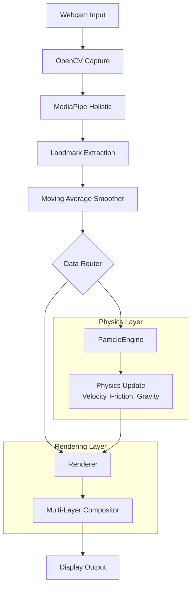

# KineticGhost.ai: Real-Time Generative Motion Art

A high-performance Computer Vision installation that transforms a live webcam feed into dynamic generative art. Using MediaPipe pose estimation and a custom NumPy-based physics engine, human motion becomes an interactive neon particle system.

## Architecture



## Tech Stack

- **Language**: Python
- **Computer Vision**: OpenCV, MediaPipe (Holistic Pose Estimation)
- **Physics & Rendering**: NumPy (vectorized particle dynamics, additive blending)
- **Temporal Effects**: Motion history buffering for light trails

## Key Features

- **Real-time pose tracking**: MediaPipe Holistic with moving-average jitter smoothing
- **Particle physics**: Custom engine with velocity, friction, and gravity (20,000+ particles at 30+ FPS)
- **Neon skeleton rendering**: Multi-pass glow effect with bloom
- **Motion trails**: Velocity-based neon arcs from fast-moving extremities
- **Cinematic composition**: Vignette, additive blending, and dual background modes

## Project Structure

```
.
├── main.py                      # Application entry point
├── requirements.txt             # Python dependencies
├── README.md                    # Project documentation
├── LICENSE                      # License file
├── issue script/                # Automation scripts
│   ├── requirements_for_issues.txt
│   └── create_github_issues.py
└── src/
    ├── __init__.py
    ├── kinetic_ghost.py         # Main app: webcam loop, MediaPipe pipeline, smoothing
    ├── particle_engine.py       # NumPy-based particle physics (velocity, friction, gravity)
    └── renderer.py              # Multi-layer renderer: stardust, neon core, bloom, trails, vignette
```

## Installation

```bash
pip install -r requirements.txt
```

## Usage

```bash
python main.py
```

## Controls

- **`b`**: Toggle between pitch-black and darkened webcam background
- **`q`**: Quit

## Contributing

See [CONTRIBUTING.md](CONTRIBUTING.md).
